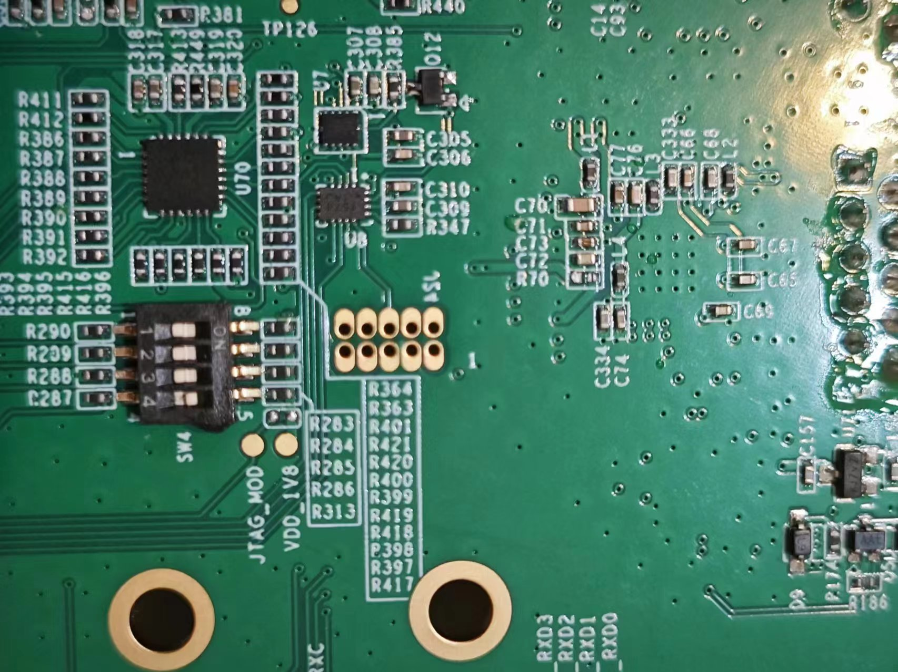

Bit-Brick's documentation!
===================================

Bitbrick documentation offers access to all products' original design materials along with relevant learning resources, which are freely available for anyone to access and utilize (in compliance with the GPL 2.0 open license, prohibiting direct commercial use).

Welcome to bit brick documentation!

Products
===================================

PI series

--------

   

   

   

   

   

   

   

.. |spacer| raw:: html

   

.. container:: row

   |img1| |img2| |img3| |img4|

.. container:: row

   |img5| |img6| |img7| |img8|

.. csv-table:: 
    :widths: 25, 25, 25, 25
    :width: 100%
    :align: center

    |img1|,|img2|,|img3|,|img4|
    |img5|,|img6|,|img7|,|img8|

   

.. toctree::
   :maxdepth: 3
   :caption: imx8mp

   imx8mp/index

.. toctree::
   :maxdepth: 3
   :caption: getting-started

   getting-started/getting-started

   